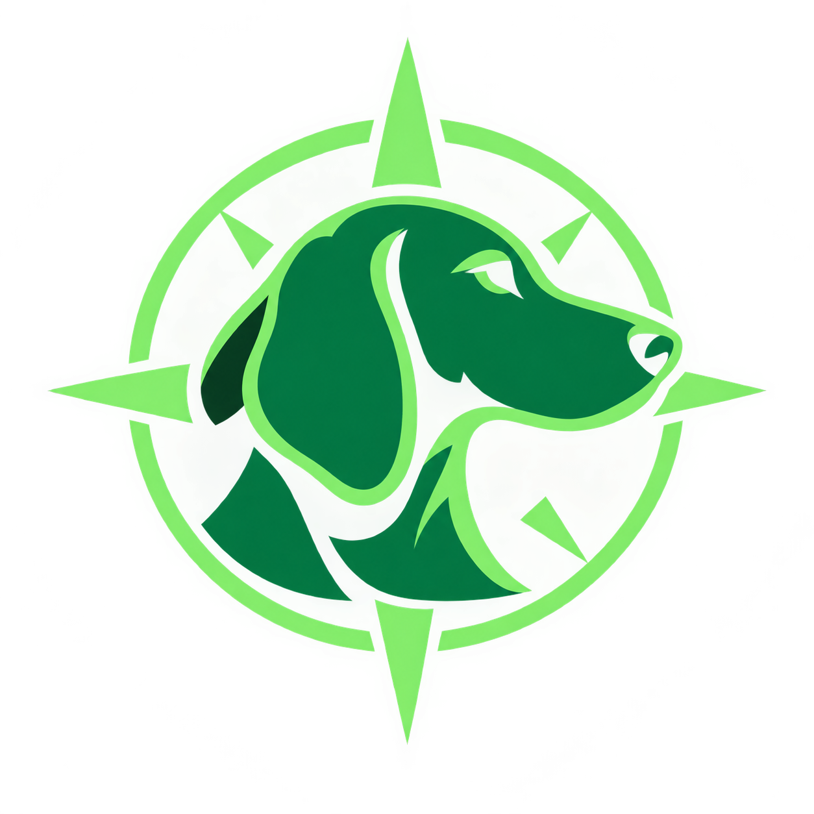

# DhogNav



DhogNav is a public introduction plugin, version **0.0.0.1**. It explains where
to obtain the full plugin and how to install it with Aethertek Plugin Manager
(APM). Open the window with `/dnav` or either plugin UI button.

[Join Discord](https://discord.gg/VsXqydsvpu) ·
[Visit Aethertek](https://aethertek.io/) ·
[Support development on Ko-fi](https://ko-fi.com/mcvaxius)

Visit **The Dumpster Fire** channel for plugin help and discussion.

## Install the full plugin

1. Copy the direct full-plugin ZIP URL from Discord (`DhogNav.zip` or `DhogNav-v<version>.zip`).
2. Open `/apm` and check **I trust the publisher**.
3. Select **DhogNav** in APM's development-plugin list.
4. Choose **Update selected plugin from clipboard**.

The full plugin replaces this introduction and uses the same `/dnav` command.

## Build

Install the .NET 10 SDK and place the Dalamud API 15 development files under
`%AppData%\XIVLauncher\addon\Hooks\dev`, then run:

```powershell
dotnet restore -r win DhogNav.csproj
dotnet build DhogNav.csproj --configuration Release --no-restore -p:Platform=x64
```

The packaged plugin is written to `bin/x64/Release/DhogNav/latest.zip`. For a
local preview build, `Z:\dnavp.bat` builds this project, copies the package to
`latest.zip` in this repository, and prints the development DLL and package
paths.

Future releases will publish `latest.zip` and `DhogNav.json` on the repository's
[Releases page](https://github.com/McVaxius/dhognav-public/releases). The
Dalamud feed URL is
`https://raw.githubusercontent.com/McVaxius/dhognav-public/main/repo.json`.
